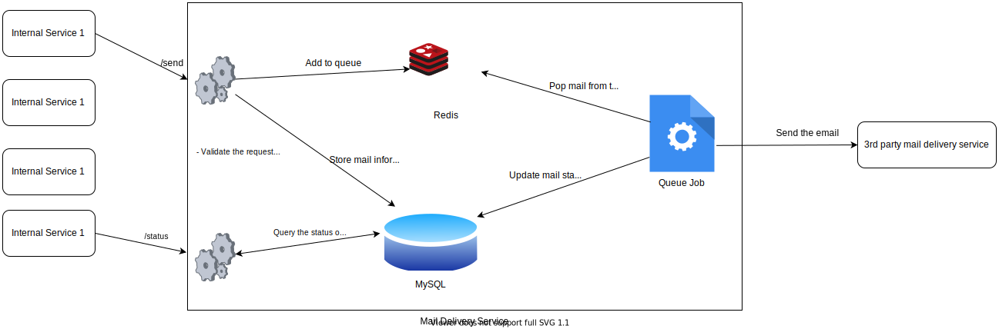

# Mail Delivery Service

- Description: Mail Delivery Gateway using Redis
- Architecture diagram:

- Project setup:
    - Install Docker and Docker-compose if you haven't
    - Run `docker-compose up -d --build`
    - The application should be now running in your localhost:8000
    - To start QueueJob (that is responsible of sending emails to the 3rd party service):
        - To run it the background : `docker-compose exec -d www php MailQueueJob.php`
        - To run it in the current process (to check it's messages) : `docker-compose exec www php MailQueueJob.php`
- Improvements: 
    - Write unit/integration tests
    - Refactor code

The service can be extended to handle priority just by sending a new field with the request (e.g: priority: high).
